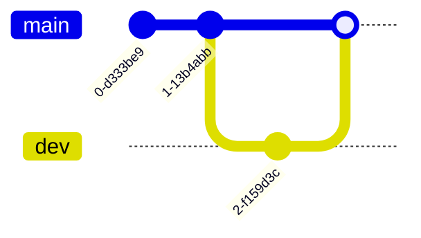

# Mermaid Diagram Examples

Mermaid diagrams provide lightweight, code-based visuals ideal for use in data governance, analytics, and digital transformation projects. In the **water sector**, they are particularly useful for documenting SCADA workflows, governance processes, CIP project timelines, asset lifecycle states, and stakeholder communication flows — all in a version-controlled format that’s easy to embed in MkDocs or GitHub wikis.

This reference includes examples of all supported Mermaid diagram types relevant to technical documentation.

---

## Flowchart

**Description:**
Used for simple process flows, logic structures, or decision diagrams. Ideal for visualizing system logic, workflows, or stakeholder engagement steps in governance.

**Syntax:** `flowchart`

**Rendered Diagram:**


**Mermaid Code:**

````text

````

---

## Sequence Diagram

**Description:**
Visualizes interactions between components over time. Useful for illustrating SCADA alert flows or data handoffs across departments.

**Syntax:** `sequenceDiagram`

**Rendered Diagram:**


**Mermaid Code:**

````text

````

---

## Class Diagram

**Description:**
Represents object-oriented data structures. Ideal for modeling asset hierarchies or telemetry object models.

**Syntax:** `classDiagram`

**Rendered Diagram:**


**Mermaid Code:**

````text

````

---

## State Diagram

**Description:**
Illustrates state transitions. Useful for equipment states (on/off), work order flows, or data validation stages.

**Syntax:** `stateDiagram-v2`

**Rendered Diagram:**


**Mermaid Code:**

````text

````

---

## Entity Relationship Diagram (ERD)

**Description:**
Models database relationships. Ideal for billing systems, AMI integrations, or customer-asset linkages.

**Syntax:** `erDiagram`

**Rendered Diagram:**


**Mermaid Code:**

````text

````

---

## Gantt Chart

**Description:**
Displays project timelines and milestones. Common for CIP planning or dashboard rollout tracking.

**Syntax:** `gantt`

**Rendered Diagram:**


**Mermaid Code:**

````text

````

---

## Pie Chart

**Description:**
Visualizes simple proportion breakdowns (e.g., usage by sector, cost by category).

**Syntax:** `pie`

**Rendered Diagram:**


**Mermaid Code:**

````text

````

---

## Git Graph

**Description:**
Models Git workflow. Useful for documenting ETL pipelines or dashboard versioning.

**Syntax:** `gitGraph`

**Rendered Diagram:**



**Mermaid Code:**

````text

````

---

---

## Timeline

**Description:**
Used for plotting key events chronologically (e.g., audits, go-lives).

**Syntax:** `timeline`

**Rendered Diagram:**


**Mermaid Code:**

````text

````

---

## Journey (User Journey)

**Description:**
Maps user steps and emotional states across a process. Great for CX design or customer billing feedback.

**Syntax:** `journey`

**Rendered Diagram:**


**Mermaid Code:**

````text

````
