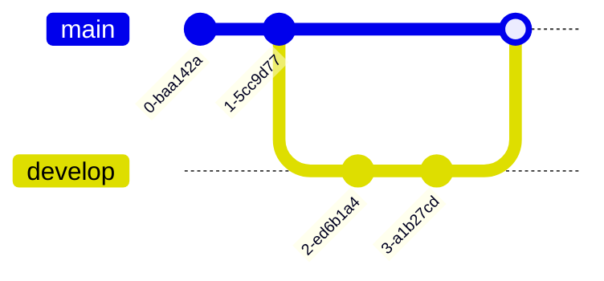

# Mermaid Diagram Examples

## Design Thinking Flowchart

## Agile / Kanban Flowchart

## Sequence Diagram

## Gantt Chart

## Class Diagram

## State Diagram

## Entity Relationship Diagram (ERD)

## Pie Chart

## Git Graph

