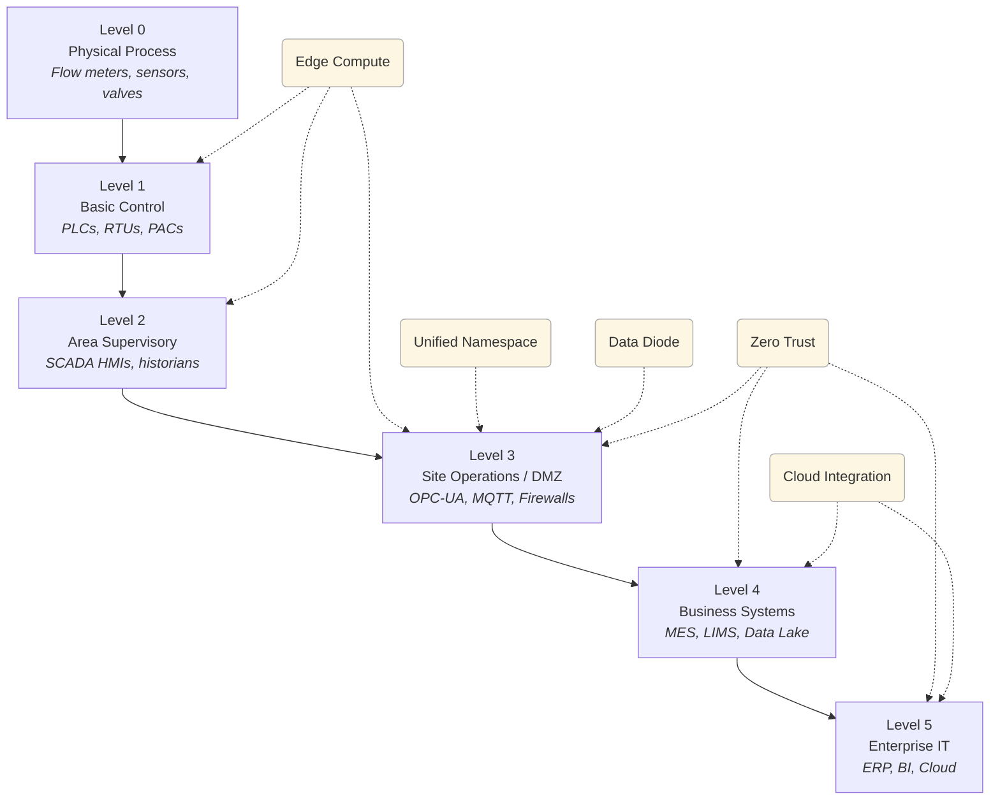

# Purdue Model for Industrial Control Systems (ICS)

The **Purdue Model**—also known as the **Purdue Enterprise Reference Architecture (PERA)**—is a layered framework that defines how operational technology (OT) and information technology (IT) systems interact in industrial environments. It offers a standardized view for segmenting networks, aligning responsibilities, and securing critical infrastructure such as utilities, manufacturing plants, and water systems.

The model is organized into **six hierarchical levels**, from the physical processes at the bottom to cloud and enterprise systems at the top. Each level represents a different layer of control, communication, or computation.

---

## Purdue Model Overview

### Level 0: Physical Process
This is the foundational layer, where actual industrial processes occur. Devices at this level include **sensors and actuators** that monitor and control parameters such as pressure, flow, and temperature in real time.

- **Examples:** Flow meters, temperature sensors, valves, actuators

### Level 1: Basic Control
Devices at this level issue commands to the field equipment in Level 0. These are typically programmable logic controllers (PLCs), remote terminal units (RTUs), and other embedded control systems responsible for direct machine control.

- **Examples:** PLCs, RTUs, PACs, motor controllers

### Level 2: Area Supervisory Control
Level 2 includes **local monitoring and supervisory control systems**. Operators use these systems to interact with the process in real time. They aggregate data from Level 1 devices and may store it locally or forward it to higher layers.

- **Examples:** SCADA HMIs, historian nodes, batch control systems

### Level 3: Site Operations / DMZ
This layer serves as a **bridge between IT and OT**, providing secure aggregation and buffering of plant-level data. It’s typically placed in a **demilitarized zone (DMZ)** that enforces strict access control and traffic monitoring.

- **Examples:** SCADA servers, OPC-UA brokers, MQTT bridges, firewalls

### Level 4: Business Logistics Systems
Level 4 systems manage **site-wide operations and business functions**. These applications coordinate production planning, maintenance scheduling, quality assurance, and compliance reporting.

- **Examples:** MES, CMMS, LIMS, plant historians, data lakes

### Level 5: Enterprise Network (IT)
At the top of the stack are the corporate IT systems that enable **organization-wide functions**, often spanning multiple sites. These include cloud services, ERP platforms, and business intelligence systems used for strategic decision-making.

- **Examples:** ERP, CRM, Microsoft 365, Power BI, cloud storage

---

## Modern Enhancements to the Purdue Model

To support modern analytics, security, and interoperability, several enhancements have emerged that build on the traditional Purdue structure:

- **Edge Compute (Levels 1–3):** Performs local preprocessing of OT data to reduce latency and cloud dependency.
- **Unified Namespace (L3.5):** Implements real-time publish/subscribe architectures (e.g., MQTT) for decoupling data producers and consumers.
- **Cloud Integration (Levels 4–5):** Enables centralized storage, dashboards, AI/ML models, and remote collaboration.
- **Zero Trust Architecture (Levels 3–5):** Applies fine-grained access controls, encrypted communications, and network segmentation.
- **Data Diodes / Brokers (L3.5):** Enforce one-way communication paths to protect OT from external threats.

---

## Purdue Model with Enhancements

